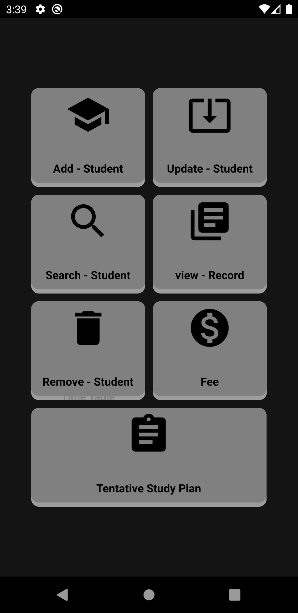
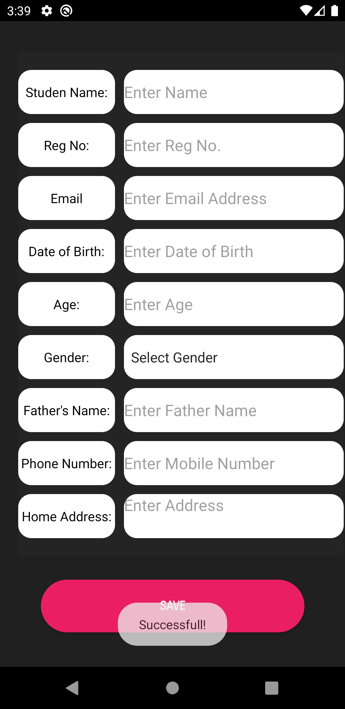
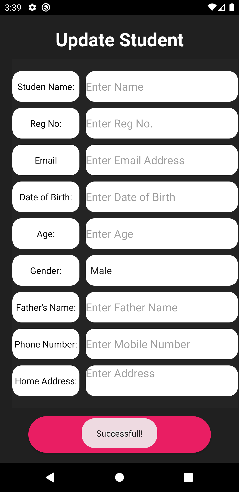
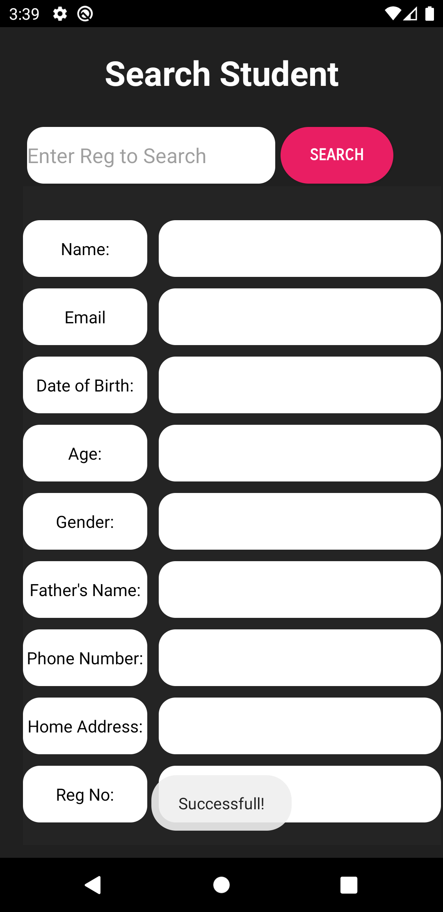

<h1>Scholar Inn app<h1/>  

This is Simple student management system build in java and Firebase android application ,this application take all the operation like Add_Student, Search_Student, Delete_Student and Update_Student record.

 

<h3>Animations used in app<h3/>
  <h4><ul>
  <li>Lottie Animation</li>
  <li>Paper onBoarding</li>
  <li>Sweet alert dialog</li>
</ul><h4/>

<h1>Application UI<h1/>

